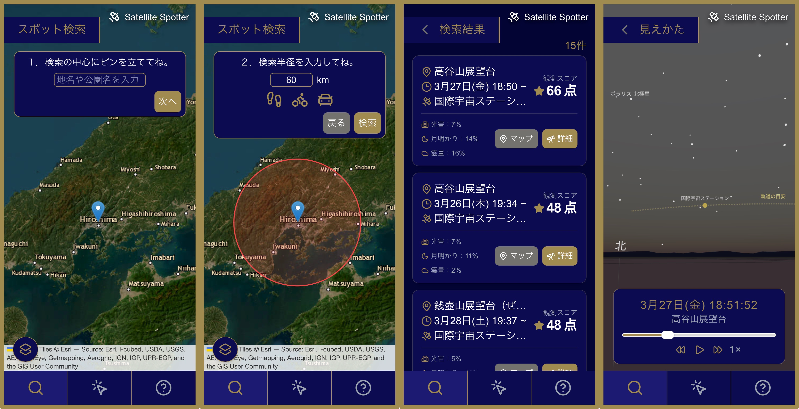
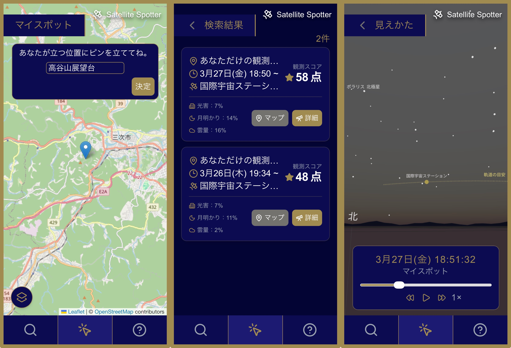

# Satellite Spotter
人工衛星の観測に最適な場所と時間を推薦するWebアプリケーションです．地形・光害・気象データ等を組み合わせ，ユーザにより良い観測体験を提供します．

## 目次
- [使用技術](#使用技術)
- [主な機能](#主な機能)
- [開発ロードマップ](#開発ロードマップ)

## 使用技術
### フロントエンド

    
    
    
    

### バックエンド

    
    

### データベース

    

### インフラ

    

## 主な機能
- スポット検索：指定したエリア周辺から，データに基づいた最適な観測スポットと観測イベントを推薦します．

    

- マイスポット：地図上の任意の地点を指定し，データに基づいた最適な観測イベントを推薦します．

    

## 開発ロードマップ

### 1. テーマ決定
- ブレインストーミング
- アイデア評価（[インパクト対実現可能性マトリクスを見る](idea_selection/impact_feasibility.pdf)）

### 2. 技術実証（Proof of Concept）
アプリケーションのコア機能を実現するため，以下の技術的な検証を行いました．

#### （ア）観測候補地の探索
- 目的：地図データから，夜間の観測に適した公園や展望台を抽出する．
- 手法：OpenStreetMapのデータから，候補地点をリストアップするプログラムを実装．
- 成果物：`PoC/osm.py`

#### （イ）衛星通過イベントの予測
- 目的：特定の場所と時間における，人工衛星の可視タイミングと位置を計算する．
- 手法：Skyfieldライブラリと最新の軌道データ（TLE）を用いて，人工衛星の位置を算出．また，スターリンクトレイン特有の軌道パターンを検出する独自のアルゴリズムを開発．平均近点角の円周標準偏差を利用．
- 成果物：`PoC/Skyfield/skyfield_test.py`，`PoC/Skyfield/potential_train.py`

#### （ウ）観測条件のスコアリング
観測候補地の質を定量的に評価するため，複数の地理空間データを用いた指標を作成しました．

- 地形スコア
    - 手法：国土地理院の「基盤地図情報（数値標高モデル）５ｍメッシュ（航空レーザ測量）」を用いて，任意の地点からの可視範囲をシミュレート．計算を高速化するため，~~Pythonの並列処理を導入．~~
    Numpyの行列演算を使用．
    - 成果物：`PoC/horizon_profile.py`，`PoC/dem_converter.py`

- 光害スコア
    - 手法（改善前）：~~Suomi-NPP衛星によるVIIRS夜間光画像データを利用し，都市の光が夜空の暗さに与える影響を独自に数値化．~~
    - 手法（改善後）：World Atlas 2015のデータを採用．このデータセットは，VIIRSのデータ等を基にしたモデルによって「地上から見た夜空の明るさ」を計算したものであり，より現実に則した光害の評価が可能．World Atlas 2015の輝度データ（mcd/m²）を，限界等級（NELM）に変換して光害をスコアリング．
    - 成果物：`PoC/VIIRS_Nighttime_Light/sky_glow_score.py`，`PoC/SQM/calc_sqm_by_world_atlas_2015_dataset.py`

- 気象スコア
    - 手法：Open-Meteo APIから取得した気象予報（降水・雲量・視程）を基に，観測当日の空の状態をスコアリング．
    - 成果物：`PoC/open_meteo.py`

- 月相スコア
    - 手法：Skyfieldライブラリを用いて，月面のうち太陽光を反射して輝いて見える部分の割合が，夜空の暗さに与える影響を独自に数値化．
    - 成果物：-

- 不快度スコア（未実装）
    - 手法：植生指数や水辺までの距離を使用し，虫が発生するポテンシャルを数値化．
    - 成果物：-

### 3. アプリ設計
- ワイヤーフレームの作成（[ワイヤーフレームを見る](wireframe/wireframe.pdf)）
- OpenAPI仕様書の作成（[仕様書を見る](api_specification/satellite-spotter-api-dev.yml)）

### 4. システム実装
PoCで検証した要素技術を統合し，Webアプリケーションとしての実装・改善を行いました．

（ア）データベース構築とデータ統合
- 空間データベースの構築：PostGISを導入し，全国の地名データや公園・展望台（スポット）の空間検索（指定座標からの半径検索など）を実装．
- 事前計算データの統合：アプリの応答速度を向上させるため，各スポットにおける「DEM5Aに基づく地形シルエット」と「World Atlas 2015に基づく光害スコア」をバッチ処理で事前計算し，データベースに格納．

（イ）バックエンドAPI開発（FastAPI）
- RESTful APIの設計：スポット検索，観測イベントの推薦，および天球描画用の時系列軌道データを提供する各エンドポイントを実装．
- 外部APIの非同期処理：天候スコア算出のため，Open-Meteo APIへのリクエストを非同期化（セマフォによる並行処理制限あり）し，I/O待ちによる遅延を低減．
- 動的計算の最適化：マイスポット（地図上の任意地点）における動的な地形シルエットの計算において，当初のプロセスベースの並列処理から，Numpyの行列演算へのリファクタリングを実施し，計算時間の短縮を達成．

（ウ）フロントエンド開発（Next.js / TypeScript）
- 直感的な地図インターフェース：React Leafletを用いて，地図の種類切り替えや，検索半径の視覚化，地図上のタップによる座標取得機能（マイスポット）を実装．
- UXの向上：検索結果の段階的読み込み（無限スクロール）や，Zustandによる検索結果のメモリキャッシュ機構を導入し，画面遷移時のストレスを低減．

（エ）3D天球シミュレータの実装（React Three Fiber）
- 星空と軌道の可視化：ヒッパルコス星表に基づく恒星の配置，観測地点周囲の地形シルエット，そして衛星の位置および軌跡を3D空間に描画．
- タイムコントローラ：天球の再生機能において，ブラウザの描画サイクルと現実の経過時間を同期させる処理を実装．デバイスの性能差に依存しない，正確な再生機能を実現．

（オ）インフラストラクチャ・環境構築（Docker）
- docker-compose：フロントエンド，バックエンド，データベースの3層をコンテナ化．
